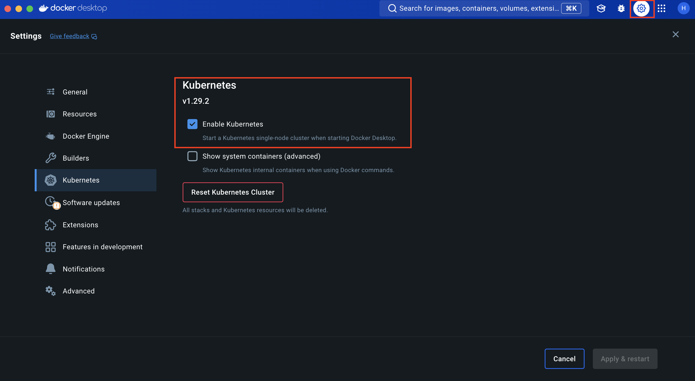

# Spark Sobre Kubernetes

Kubernetes ofrece un entorno de administración centrado en contenedores, facilitando que se pueda orquestar el despliegue de diferentes tipos de aplicaciones o frameworks al configurar las imágenes de docker que se estén usando. Entre estos frameworks tenemos spark, una tecnología que al día de hoy es altamente usada para procesar un alto volumen.

Aunque spark puede ser probado localmente en su modo standAlone este no permite evidenciar como spark puede funcionar en un entorno distrubuido; por esta razón se usa kubernetes, para crear un cluster de spark que se nos asemeje a un entorno productivo.

Ahora bien, hay dos maneras de poder configurar todo nuestro entorno de desarrollo y configurar nuestro cluster de Spark.

1. Crear una imagen de Docker en la cual podremos indicarle a docker todo lo que necesitamos para desplegar spark en los contenedores.
2. Utilizar un gestor de paquetes de kubernetes que nos facilite este proceso llamado Helm. Este proceso es más sencillo, ya que automatiza la distribución de las aplicaciones con un formato de paquetes denominado charts de Helm los cuales conservan la uniformidad de los contenedores y, a la vez, definen la manera en que se cumplirán los requisitos específicos de las aplicaciones al aplicar el mismo marco de configuración a varias instancias.

Por último, es importante escoger nuestro formato de paquetes para spark. este formato de paquetes es el que indicará las configuraciones de nuestra imagen de spark que será desplegado en kubernete. Para este serie de charlas se proponen dos:

SparkOperator: Es la solución liberada por Google para desplegar spark sobre kubernetes usango Helm charts, que actualmente recibe soporte de un tercero, que es kuberflow.

Bitnami: Es la opción distribuida por esta compañia (bitnami) para spark.

Ambos funcionan muy bien para el enfoque de las charlas y para ambientes de desarrollo, pero a diferencia de sparkOperator , bitnami cuenta con una documentación más amplia y permite una mejor integración con otros servicios que provee bitnami.

Durante las sesiones, se usarán las dos opciones.

## Configurando el entorno

1. Tener docker instalado. Para mac installed [here](https://docs.docker.com/desktop/install/mac-install/)

2. Habilitar Kubernetes engine
ir a las opciones de configuración de Docker y habilitar el kubernetes engine: Esto permite que kubernetes este usando el contexto de docker.

3. Installar Kubetctl: herramienta de Linea de comandos para kubernetes.
[here] (https://kubernetes.io/docs/tasks/tools/install-kubectl-macos/)

Puedes validar la instalación para los demás Sistemas operativos.

Una vez instalado kubectl puedes valir que en realidad se esta usando el contexto de docker, sino por favor configuralo:

kubectl config get-contexts
kubectl config use-context docker-desktop

4. Instalar helm. 
[here](https://helm.sh/docs/intro/install/)

