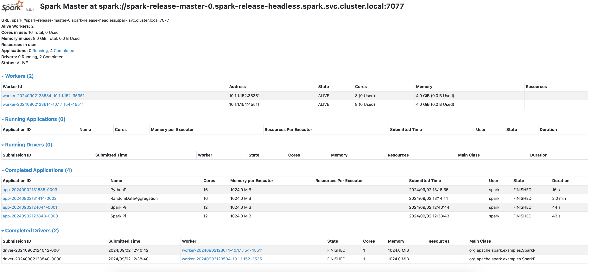
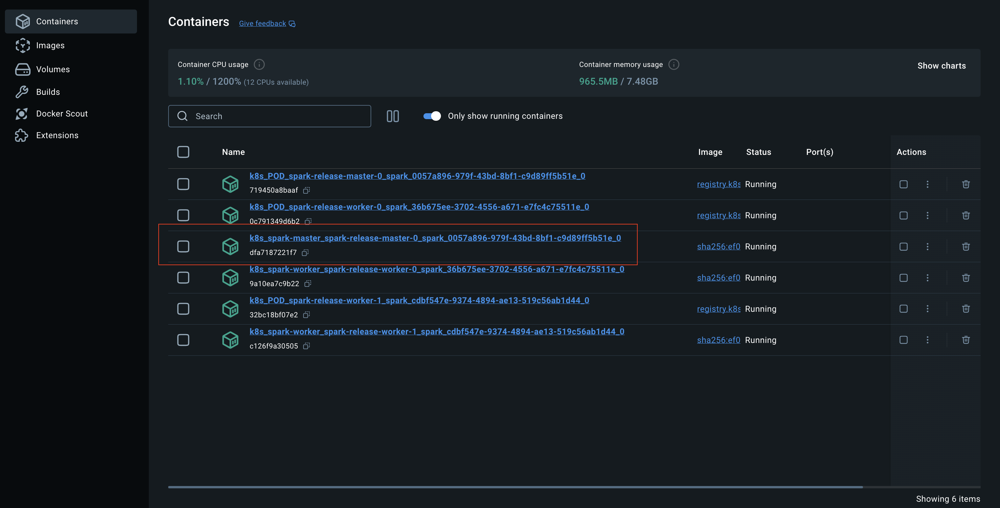
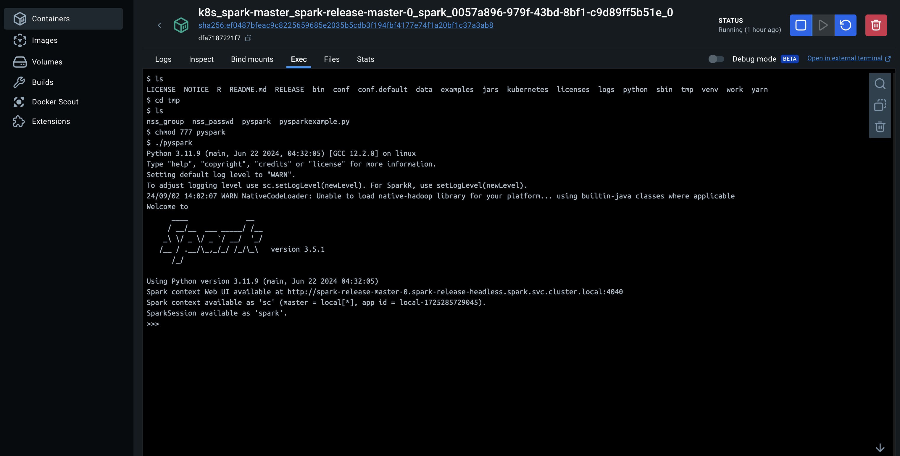

# Spark Running on Kubernetes using Helm Charts!!!

This is a repo containing the necessary things to get you up and running with spark, helm and kubernetes

## Prerequisites

- Have docker desktop for mac installed [here](https://docs.docker.com/desktop/install/mac-install/).
- Enable the Kubernetes cluster within docker desktop [here](https://docs.docker.com/desktop/kubernetes/).
- Have Kubetctl installed [here](https://kubernetes.io/docs/tasks/tools/install-kubectl-macos/)
- Have helm installed [here](https://docs.docker.com/desktop/install/mac-install/).

## Configuring Spark Master as reverse proxy

Please go to config/values.yaml file

Spark offers configuration to enable running Spark Master as reverse proxy for worker and application UIs. This can be useful as the Spark Master UI may otherwise use private IPv4 addresses for links to Spark workers and Spark apps

before that you need to create a domain. Please go to etc/hosts file and add it.
for example:
127.0.0.1  localhost

On the other hand you can setup the number of workers that you want and the resource for each one.

## Now to get it installed

1. Install the chart:

```console
### Add bitnami repo to your own repository

helm repo add bitnami https://charts.bitnami.com/bitnami
helm install spark-release bitnami/spark -f config/values.yaml  --namespace spark --create-namespace

You can choose the number of workers to deploy as helm parameters:
--set worker.replicaCount=2
otherwise, you can do it inside values.yaml file that was described before

### uninstall all pods for release name:
helm ls -n spark
helm uninstall spark-release -n spark

### Check if kubernetes is running
kubectl get nodes -n spark
```s

2. Enable Spark UI

export HOSTNAME=$(kubectl get ingress --namespace spark spark-release-ingress -o jsonpath='{.spec.rules[0].host}')

echo "Spark-master URL: http://$HOSTNAME/"

## Examples

### Run spark-pi example:

This code is an example of how to calculate the approximate value of Pi using a Monte Carlo method. Inputs: number of partitions which data will be separeted and it works to calculate number of samples

How Can I get spark master url?
kubectl get svc -n spark
spark-release-master-svc:7077

1. Running spark-pi scala code:

note: default deploy-mode value is "client"

kubectl exec -ti -n spark spark-release-master-0 -- spark-submit --master spark://spark-release-master-svc:7077 \
  --deploy-mode client \
  --conf spark.kubernetes.container.image=bitnami/spark:3 \
  --class org.apache.spark.examples.SparkPi \
  /opt/bitnami/spark/examples/jars/spark-examples_2.12-3.5.1.jar 5000

2. Running spark-pi pyspark code:

kubectl exec -ti -n spark spark-release-master-0 -- spark-submit --master spark://spark-release-master-svc:7077 \
  --deploy-mode client \
  --conf spark.kubernetes.container.image=bitnami/spark:3 \
  --class org.apache.spark.examples.SparkPi \
  /opt/bitnami/spark/examples/src/main/python/pi.py 500

3. Running your own project

To run your own projects on Kubernetes, you need to move your files to one of the containers that were created—in this case, the master—from which they will be submitted and deployed to the cluster.

You can run your own project by using the following command:

kubectl cp examples/pysparkexample.py spark-release-master-0:/opt/bitnami/spark/tmp -n spark

kubectl exec -ti -n spark spark-release-master-0 -- spark-submit --master spark://spark-release-master-svc:7077 \
  --deploy-mode client \
  /opt/bitnami/spark/tmp/pysparkexample.py

  3.1 Running with your own modules
  kubectl exec -ti -n spark spark-release-master-0 -- spark-submit --master spark://spark-release-master-svc:7077 \
    --deploy-mode client \
    --py-files file1.py,file2.py,file3.zip \
    /opt/bitnami/spark/tmp/pysparkexample.py


4. Tunning nodes resources

Run this command in your terminal

kubectl exec -ti -n spark spark-release-master-0 -- spark-submit --master spark://spark-release-master-svc:7077 \
  --deploy-mode cluster \
  --driver-memory 1g \
  --executor-memory 1g \
  --executor-cores 4  \
  --conf spark.kubernetes.container.image=bitnami/spark:3 \
  --conf spark.standalone.submit.waitAppCompletion=true \
  --conf spark.ui.reverseProxy=true \
  --conf spark.ui.reverseProxyUrl=http://localhost \
  --class org.apache.spark.examples.SparkPi \
  /opt/bitnami/spark/examples/jars/spark-examples_2.12-3.5.1.jar 500

note: Since cluster deploy mode is currently not supported for python applications on standalone clusters, we are gonna use client mode.

kubectl exec -ti -n spark spark-release-master-0 -- spark-submit --master spark://spark-release-master-svc:7077 \
  --deploy-mode client \
  --driver-memory 1g \
  --executor-memory 1g \
  --executor-cores 2  \
  --conf spark.kubernetes.container.image=bitnami/spark:3 \
  --conf spark.standalone.submit.waitAppCompletion=true \
  --conf spark.ui.reverseProxy=true \
  --conf spark.ui.reverseProxyUrl=http://localhost \
  --class org.apache.spark.examples.SparkPi \
  /opt/bitnami/spark/examples/src/main/python/pi.py 500

Go to Spark-master URL: http://$HOSTNAME/"
and check your workloads




6. Enable interactive pyspark shell 

Sometimes it can be useful to use the console to send some Spark commands And quickly test some lines of code. To do this, we need to enable the PySpark environment because, by default, the Bitnami image for Spark has a bug that prevents the console from being enabled. Below are the steps to enable it:

6.1 copy a new pyspark bash script inside main container
run in your terminal:
kubectl cp config/pyspark spark-release-master-0:/opt/bitnami/spark/tmp -n spark
6.2 go to Docker and open master container, then Move to new location opt/bitnami/spark/tmp 



6.3 Grant permission
now, in container docker terminal type
chmod 777 pyspark
6.3 ./pyspark



6.4 run the pysparkexample_terminal.py script line by line to play with terminal


3. Enable Kubernetes dashboard
```console
helm repo add kubernetes-dashboard https://kubernetes.github.io/dashboard/
helm upgrade --install kubernetes-dashboard kubernetes-dashboard/kubernetes-dashboard --create-namespace --namespace kubernetes-dashboard
```
3.1 create Creating sample user
We are going to crea a new servicesAccount with cluster-admin permissions
```console
kubectl apply -f dashboard-adminuser.yaml
```

3.2 Open Kubernetes dashboard
```console
 kubectl -n kubernetes-dashboard port-forward svc/kubernetes-dashboard-kong-proxy 8443:443
```

3.3 Generate a new token
```console
kubectl -n kubernetes-dashboard create token admin-user
```
Go to URL: 127.0.0.1:8443

3.4 clean up
```console
kubectl -n kubernetes-dashboard delete serviceaccount admin-user
kubectl -n kubernetes-dashboard delete clusterrolebinding admin-user
```


kubectl exec -ti -n spark spark-release-master-0 -- spark-submit \
  --master spark://spark-release-master-svc:7077 \
  --deploy-mode client \
  --driver-memory 1g \
  --executor-memory 1g \
  --executor-cores 2  \
/opt/bitnami/spark/tmp/pysparkexample.py


    